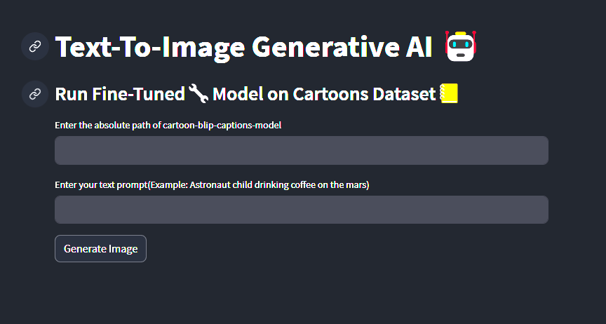

<h1 align="center"> Cartoon Diffusion V1 </h1>
<h3 align="center">  Generate cartoon like images from user prompt </h3>

 

  

 
<h2 id="about-the-project">Project Overview</h2>

  

<h2 id="liveApp" href=> <a href="https://text2imagegen.streamlit.app/"> Try App Live with Streamlit! </a> </h2>

<!-- ABOUT THE PROJECT -->
<h2 id="about-the-project">About The Project</h2>

Welcome to the Stable Diffusion based text-to-image generative AI repository!

This readme file provides you with all the necessary information to install, run, and understand the Stable Diffusion AI model.

<!-- 
<h2 id="liveApp" href=> <a href="https://rlcontrol.streamlit.app"> Try the App Live with Streamlit! </a> </h2> -->

<!-- INSTALL HOW TO -->
<h2 id="install"> Installation and Training Steps</h2>

  <a href="README_TRAIN.md" target="_blank">Please follow the training guide</a>

  

<h2 id="install">Running App Locally </h2>
  
    0. Install the requirements
      Follow 'Installation' section in README_TRAIN.md file
    1. Create and activate tti_env environment
      `conda activate tti_env`
    2. Train the algorithm
      Follow 'Running Training' section in README_TRAIN.md file
    3. Run the app for test trained AI and watch app at `http://localhost:8502`
      `streamlit run app.py` 

<h2 id="install">Deployment</h2>

  Build docker image for web/cloud deployment. 
  - `docker build -t t2img_docker .`

  Streamlit/Gradio will automatically build docker image from this dockerfile.

  

<!-- PREREQUISITES -->
<h2 id="prerequisites"> :fork_and_knife: Prerequisites</h2>

The following open source packages are used in this project:
* torchvision
* accelerate>=0.16.0
* transformers>=4.25.1
* datasets
* ftfy
* tensorboard
* Jinja2
* xformers
* bitsandbytes
* scipy
* streamlit

<h2 id="future"> Future Work </h2>

* Add different models
* Search datasets online
* Add training page(requires hardware)
