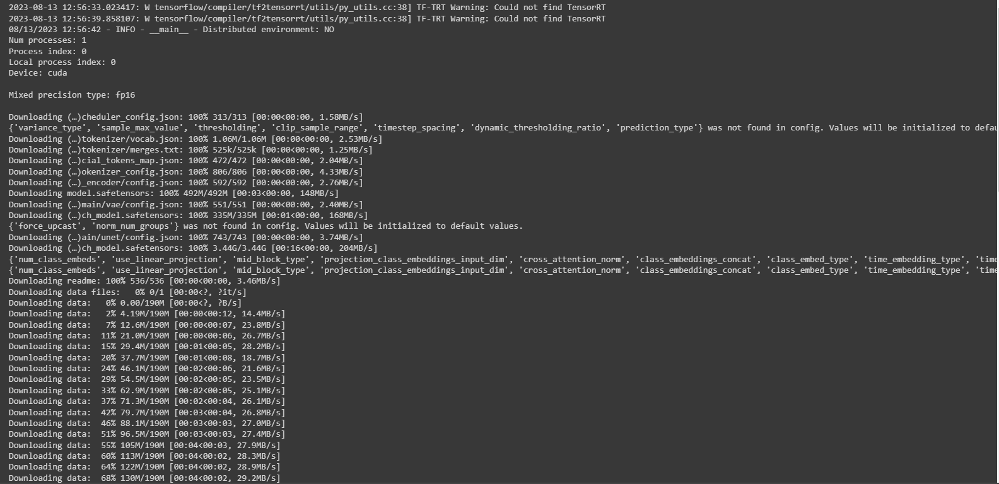
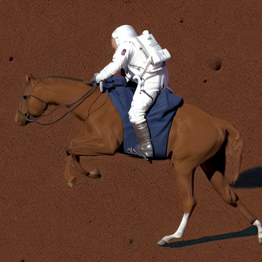
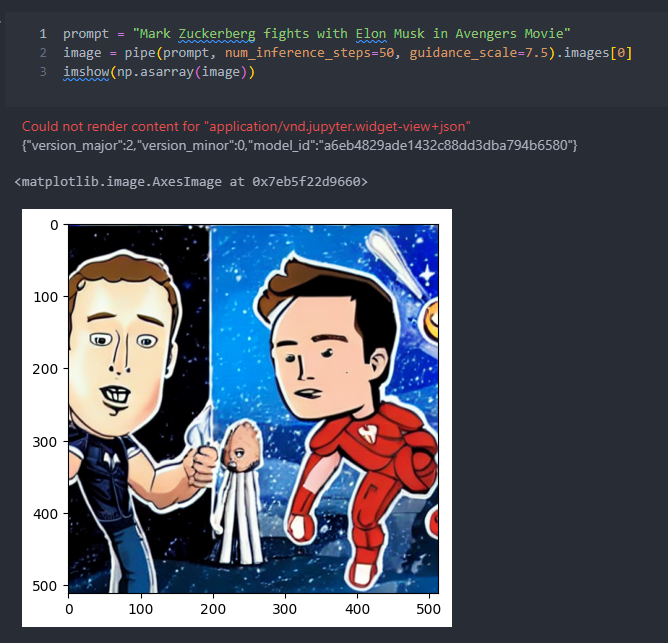
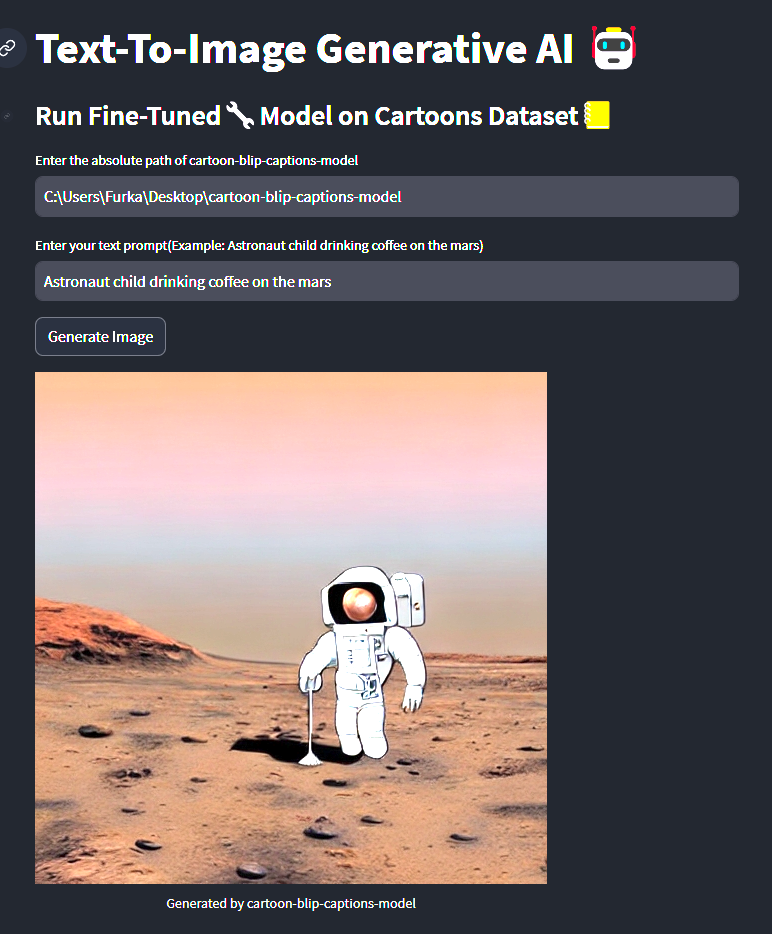

# Training Stable Diffusion Training Readme

Welcome to the Stable Diffusion based text-to-image generative AI repository! This readme file provides you with all the necessary information to install, run, and understand the Stable Diffusion AI model.

## Table of Contents

1. [Installation](#installation)

Welcome to the Stable Diffusion based text-to-image generative AI repository! This readme file provides you with all the necessary information to install, run, and understand the Stable Diffusion AI model.

## Table of Contents

1. [Installation](#installation)
2. [Training](#training)
3. [Sample Input/Output](#sample-inputoutput)
4. [Training Dataset](#training-dataset)
5. [Model Complexity](#model-complexity)
6. [Model Evaluation Metric](#model-evaluation-metric)
7. [Web Deployment](#web-deployment)
---

## Installation

To set up the Stable Diffusion AI codebase, follow these steps:

1. Clone the repository to your local machine:

```bash
git clone https://github.com/frknayk/TextToImageApp.git
cd TextToImageApp
```

2. Create a conda environment (recommended):

```bash
# Create a Conda virtual environment
conda create -n tti_env python=3.10

# Activate the Conda environment
conda activate tti_env

# Navigate to the repository directory
cd path/to/TextToImageApp

# Install the required packages using pip within the Conda environment
pip install -r requirements.txt
```

<!-- 3. Login to Huggingface
  1. Please create an Huggingface account if you do not have already, it is free.
  2. Create the access token and copy then paste after running following command

```bash
huggingface-cli login
``` -->


## Training


### Hardware Requirements

GPU Specs and Training Flags About Limitations
```
> Using *gradient_checkpointing* and *mixed_precision*, it should be possible to finetune the model on a single 24GB GPU. 
> For higher batch_size’s and faster training, it’s better to use GPUs with more than 30GB of GPU memory. 
```

Enable Libraries For Memory Efficiency
```
> You can also use JAX/Flax for fine-tuning on TPUs or GPUs, which will be covered below.
> You can reduce your memory footprint even more by enabling memory efficient attention with xFormers. 
Make sure you have xFormers installed and pass the --enable_xformers_memory_efficient_attention flag to the training script.
> **xFormers is not available for Flax.**
```
### Save and Load Checkpoints
Saving checkpoints is essentials in the case of failure. Use following argument to to save a checkpoint during training:
```bash
  --checkpointing_steps=50
```
This argument would save checkpoints every 50 steps.

You can also continue your training from a checkpoint by the following argument:
```bash
  --resume_from_checkpoint="checkpoint-1500"
```


### Running Training

Run `train_bash.sh` file for starting the training process.

```bash
# Initialize an 🤗 Accelerate environment with:
accelerate config default

accelerate launch scripts/train_text_to_image.py \
  --pretrained_model_name_or_path="CompVis/stable-diffusion-v1-4" \
  --dataset_name="Norod78/cartoon-blip-captions" \
  --use_ema \
  --resolution=512 --center_crop --random_flip \
  --train_batch_size=1 \
  --gradient_accumulation_steps=1 \
  --gradient_checkpointing \
  --use_8bit_adam \
  --enable_xformers_memory_efficient_attention \
  --mixed_precision="fp16" \
  --max_train_steps=300 \
  --learning_rate=1e-05 \
  --max_grad_norm=1 \
  --lr_scheduler="constant" --lr_warmup_steps=0 \
  --output_dir="cartoon-blip-captions-model"
  # --push_to_hub # If want to send trained model to HF hub.
```

Training progress and logs will be displayed in the console. Once training is complete, the trained model will be saved in the designated directory.

* NOTE: The training script `train_text_to_image.py` is taken from HuggingFace and no further changes is made on the original script. 

### Training Complete
- Training progress would be look something like 
  
  

- Training results will be created under `$OUTPUT_DIR`, folder structure will be as follow:
  - cartoon-blip-captions-model/
    -- feature_extractor/
    -- logs/
    -- safety_checker
    -- scheduler/
    -- text_encoder/
    -- tokenizer/
    -- unet/
    -- vae/
    -- model_index.json
Inference script will use this folder when loading fine-tuned network.


### About Training Script Arguments
* You can use other pre-trained networks instead of `stable-diffusion-v1-4`, take a look on [huggingface model hub](https://huggingface.co/models?pipeline_tag=text-to-image&sort=trending)
* Replace any dataset with the argument ```DATASET_HUGGING_FACE_NAME``` on the huggingface dataset hub (without exceeding memory limits, since some datasets can be enormously large)

### Evaluation Metric
Model is evaluated during train by Mean-Squared-Error(MSE) loss metric.

## Sample Input/Output (Inference)

Make sure to replace `/path/to/model`` with the actual path to the pre-trained model and adjust the prompt accordingly.
This code will read the provided arguments and execute the diffusion process with the specified parameters.

```bash
python diffusion_pipeline.py --model_path /path/to/model_dir --prompt "Your prompt here" --num_inference_steps 50 --guidance_scale 1.0
```

Here's an example of input data and the corresponding model-generated output:

```
Prompt: [an astronaut is riding a horse on the mars]
```





## Training Dataset

The Stable Diffusion based text-to-image AI model was trained on the [cartoon-blip-captions](https://huggingface.co/datasets/Norod78/cartoon-blip-captions),
a diverse collection of images and corresponding captions from hundreds of cartoons.

## Model Complexity

The Stable Diffusion AI model has approximately X million parameters, which determines its complexity and capacity for capturing intricate patterns in the data.

## Model Evaluation Metric

The primary evaluation metric used for assessing the performance of the Stable Diffusion AI model is **Mean Squared Error (MSE)**, calculated directly in the code using ground truth data and generated outputs during validation.

For any questions or issues, please contact [furkanayik@outlook.com](mailto:furkanayik@outlook.com). Enjoy using Stable Diffusion based text-to-image AI for your image generation tasks!

## Web Deployment by Steramlit

Web deployment part is made with Streamlit library which is a quick way to turn the code base to web-based application.
An overview to the web application of AI can be seen below:

  

In the web-app, user needs to enter *the absolute path* of the cartoon-blip-captions-model which is created after the training in the project folder: `path/to/TextToImageApp`


### Installation
No specific installation is required since all requirements are already installed with initial steps.

### Local Deployment of Web-App
Running streamlit app script app.py would reveal the app.
```bash
streamlit run app.py
```

### Online Deployment of Web-App
For the deployment to other platforms, compose the Dockerfile as follows:
```bash
docker build -t t2img_docker .
```

Once the docker is composed, the application can be deployed to cloud based platform to be served people around the world.
